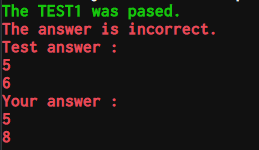

# Auto-Python-Tester

Pythonで競技プログラミングをするときに、テストを自動で実行してくれるパッケージです。

テストに成功すると、成功表示がでて


テスト失敗すると、失敗表示が出てテストのデータとソースの結果を表示してくれます。



# 注意点
Python 3.4以上対応です。

# 使い方
使うには二つのファイルが必要になります。
- 実行するPythonファイル
- テストが書いてあるファイル(*.txt)

```bash
$ Aptester Testcases.txt main.py
```
※-m を使っていなければ`aptester`でも可能です。


## pythonファイルの書き方
普通に入力と出力のあるファイルであれば問題ないです

## テストケースの書き方
```txt
-テスト名-
テストの標準入力
_テスト名_
テストの正しい出力
END
```

# 簡単なテンプレート
## Pythonファイル

## テストケースのテンプレート
```txt
-TEST1-
1 2
2 5
_TEST1_
3
7
END

-TEST2-
2 3
3 3
_TEST2_
5
6
END
```

### `-テスト名-`
ハイフンの間にテスト名を決めて書いてください
一文字以上であればなんでも大丈夫です。

### `_テスト名_`
`-テスト名-`で決めたものと同じ物を書いてください。
`-テスト名-`と`_テスト名_`間は標準入力が入る場所です

### テストの標準入力
実行するときに必要な入力を書いてください。

### テストの正しい出力
正解の出力を書いてください。

### ENDについて
テスト名とENDの間にはコメントを書くことも可能です
